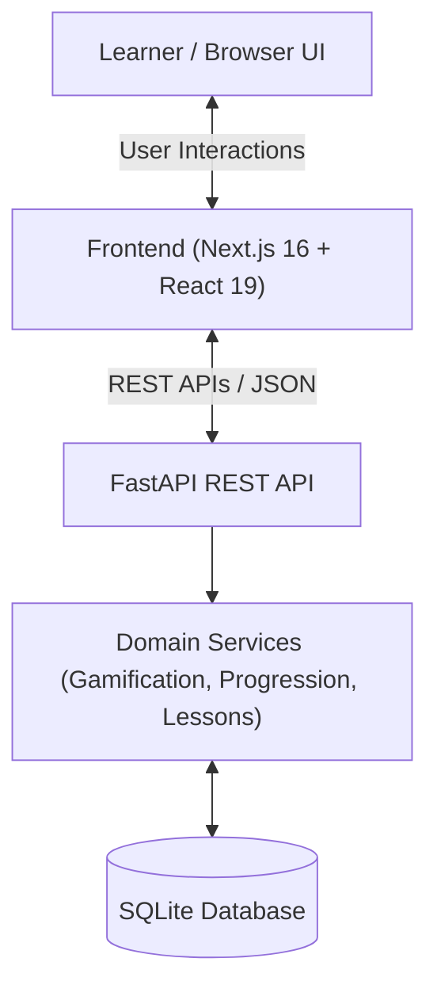
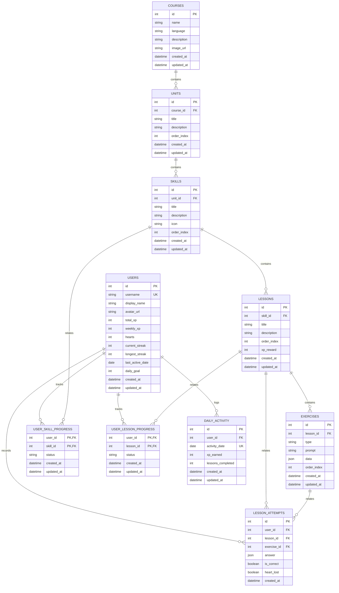

# Vocably 🦉 - Duolingo Web App Clone

🌐 **Live Demo & Deployed App:** [https://vocably.paramjit.tech/](https://vocably.paramjit.tech/)

> **Vocably** is a feature-complete, modern full-stack web application that replicates Duolingo's iconic design system, user experience, core interactive lesson loop, and gamification mechanics.

Built for the **Fullstack SDE Assignment (Duolingo Clone)** using **Next.js 16 (React 19)**, **FastAPI (Python 3.10+)**, **SQLAlchemy 2.x**, and **SQLite**.

---

## 📋 Table of Contents

- [Core Features & Duolingo Experience](#-core-features--duolingo-experience)
- [Tech Stack](#-tech-stack)
- [Architecture Overview](#-architecture-overview)
- [Database Schema & ER Diagram](#-database-schema--er-diagram)
- [API Overview](#-api-overview)
- [Assumptions Made](#-assumptions-made)
- [Setup & Installation Instructions](#-setup--installation-instructions)
  - [Prerequisites](#prerequisites)
  - [1. Backend Setup](#1-backend-setup)
  - [2. Frontend Setup](#2-frontend-setup)
- [Running Automated Tests](#-running-automated-tests)
- [License](#-license)

---

## ✨ Core Features & Duolingo Experience

### 1. 🗺️ Learning Path / Skill Tree
- **Visual Unit & Skill Path**: Dynamic learning node tree featuring Units, Skills, and Lessons.
- **Node Status Progression**: Clear states for `COMPLETED`, `IN_PROGRESS`, `NOT_STARTED`, and `LOCKED`.
- **Top Navigation Bar**: Displays current user's **Streak**, **XP totals**, **Hearts (0-5)**, and **Gems**.

### 2. 🎮 Lesson Player (The Core Interactive Loop)
- **5 Interactive Exercise Types**:
  1. `MULTIPLE_CHOICE`: Select correct translated option.
  2. `WORD_BANK` / `TAP_WORDS`: Construct sentences by selecting word tokens in order.
  3. `MATCH_PAIRS`: Match vocabulary word pairs.
  4. `FILL_BLANK`: Select the correct missing word snippet.
  5. `TYPE_ANSWER`: Type out full translated sentence responses.
- **Signature Feedback Bar**: Bottom drawer with sound/color cues ("Nicely done!", "Correct answer: ...").
- **Lesson Progress Bar**: Smooth animated progress across questions in the lesson.
- **Heart System**: Deduction on incorrect answer, auto-popup when out of hearts.

### 3. 🔥 Gamification & Persistence
- **Authoritative Streak Logic**: Backend calculates same-day activity, consecutive day streaks, and missed-day streak resets.
- **XP & Leaderboard**: Global/weekly XP rankings with competitor avatars and dynamic rank position.
- **Practice Mode**: Refill hearts (+1 heart per practice session up to max 5).
- **Daily XP Goal Tracker**: Ring progress tracking towards daily target (e.g. 50 XP/day).
- **Full Data Persistence**: User XP, hearts, streak, lesson attempts, and skill progress persist in SQLite.

---

## 💻 Tech Stack

| Layer | Technology |
| :--- | :--- |
| **Frontend Framework** | [Next.js 16](https://nextjs.org/) (App Router, React 19) |
| **Styling & UI** | [Tailwind CSS v4](https://tailwindcss.com/), [Lucide React](https://lucide.dev/), Canvas Confetti |
| **Language** | TypeScript |
| **Backend API** | [FastAPI](https://fastapi.tiangolo.com/) (Python 3.10+) |
| **ORM & Database** | SQLAlchemy 2.x & SQLite3 |
| **Data Validation** | Pydantic v2 & Pydantic Settings |
| **Testing** | pytest & HTTPX TestClient |

---

## 🏗️ Architecture Overview

Vocably uses a decoupled **Client-Server Architecture** enforcing **Backend Autonomy** for all critical business and gamification logic:



### Architectural Principles
1. **Authoritative Backend**: Gamification rules (hearts deduction, streak evaluation, daily goal calculation, XP allocation, skill lock/unlocking) are evaluated on the backend to avoid client-side state manipulation.
2. **Idempotent Operations**: Lesson completions are idempotent; completing a lesson multiple times will not duplicate streak increments or award extra XP.
3. **Data-Driven Exercise Storage**: Exercises use JSON columns with Pydantic validation to handle 5 heterogeneous exercise types cleanly in SQLite.

---

## 🗄️ Database Schema & ER Diagram

The database schema separates static course content from dynamic learner progression.



---

## 🔌 API Overview

Base API URL: `http://localhost:8000`  
Swagger / OpenAPI Docs: `http://localhost:8000/docs`

| Method | Endpoint | Description |
| :--- | :--- | :--- |
| **GET** | `/api/course/path` | Fetch structured learning path with computed skill/lesson lock & completion states |
| **GET** | `/api/lessons/{lesson_id}` | Retrieve lesson details and sequence of interactive exercises |
| **POST** | `/api/lessons/{lesson_id}/exercises/{exercise_id}/answer` | Validate exercise answer, record attempt, and deduct hearts if incorrect |
| **POST** | `/api/lessons/{lesson_id}/complete` | Complete lesson, award XP, update streak & daily goal, and unlock next skills |
| **POST** | `/api/practice` | Practice mode session restoring 1 heart (up to maximum 5) |
| **GET** | `/api/users/me` | Fetch active user credentials and settings |
| **GET** | `/api/users/me/progress` | Fetch user's current XP, hearts count, streak metrics, and daily goal progress |
| **GET** | `/api/users/me/profile` | Fetch comprehensive learner profile stats and achievements |
| **GET** | `/api/leaderboard` | Retrieve global weekly/total XP leaderboard with current user ranking |

---

## 💡 Assumptions Made

1. **Authentication**: Authentication is simplified; the application operates with a seeded default learner (`Paramjit`) to facilitate rapid evaluation without login barriers.
2. **Seeded Content**: Seeded with an **Hindi Essentials** course containing Units, Skills, Lessons, and 20+ Exercises covering all 5 exercise formats.
3. **Audio & Gems**: Audio clips and Gems currency are mocked/placeholders in alignment with assignment guidelines.
4. **Streak Calculation**: Streaks are evaluated on daily activity timestamps stored in UTC date format.

---

## 🚀 Setup & Installation Instructions

### Prerequisites
- **Python 3.10+**
- **Node.js 18+ & npm**

---

### 1. Backend Setup

1. **Navigate to the backend directory**:
   ```bash
   cd backend
   ```

2. **Create and activate a virtual environment**:
   - **Windows (PowerShell)**:
     ```powershell
     python -m venv venv
     .\venv\Scripts\Activate.ps1
     ```
   - **Linux / macOS**:
     ```bash
     python3 -m venv venv
     source venv/bin/activate
     ```

3. **Install backend dependencies**:
   ```bash
   pip install -r requirements.txt
   ```

4. **Seed the database**:
   Run the database seed script to populate SQLite with the course path, default user, and leaderboard competitors:
   ```bash
   python -m app.seed.seed_data
   ```

5. **Start the FastAPI backend server**:
   ```bash
   uvicorn app.main:app --reload
   ```
   The backend API will run on `http://localhost:8000`. You can inspect endpoints via Swagger at `http://localhost:8000/docs`.

---

### 2. Frontend Setup

1. **Navigate to the frontend directory**:
   ```bash
   cd frontend
   ```

2. **Install frontend dependencies**:
   ```bash
   npm install
   ```

3. **Start the Next.js development server**:
   ```bash
   npm run dev
   ```
   Open `http://localhost:3000` in your web browser to play Vocably!


## 🧪 Running Automated Tests

Run the backend test suite using `pytest`:

```bash
cd backend
pytest -v
```

### Verified Test Cases (15/15 Pass):
- ✅ Answer evaluation for all 5 exercise types
- ✅ Heart deduction, floored non-negative bounds (min 0), practice mode restoration
- ✅ Idempotent lesson completion & XP calculations
- ✅ Streak calculations (consecutive day increment, same-day retention, missed-day reset)
- ✅ Daily goal tracking & accumulation
- ✅ Sequential progression unlocking (skill & lesson locks)
- ✅ SQLite database persistence across sessions

---

## 📄 License

This project is created strictly for **educational purposes** as part of an engineering portfolio / software assignment. All Duolingo visual styling, mascot flourishes, and brand references belong to Duolingo, Inc.
