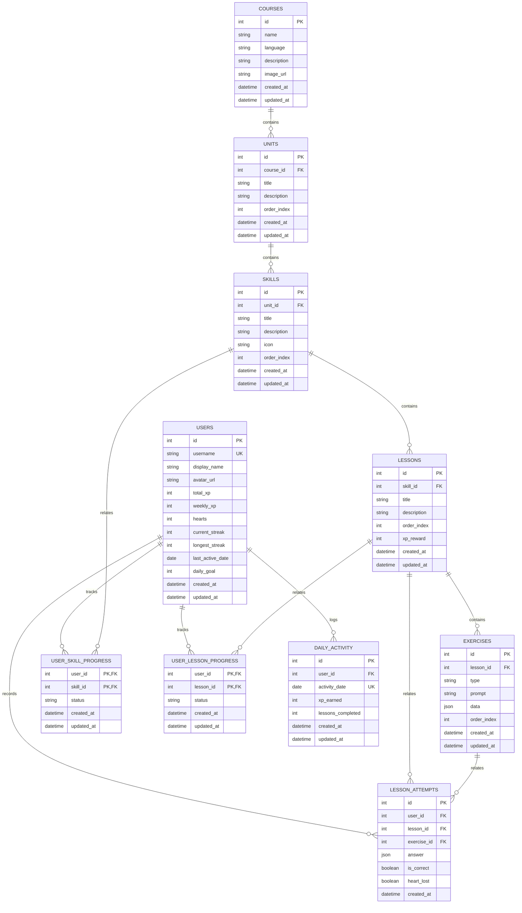

# Vocably Database Documentation

Database Engine: **SQLite**  
ORM Framework: **SQLAlchemy 2.x**

---

## Entity Relationship (ER) Diagram

---

## Schema Rationale & Key Constraints

1. **Separation of Content and User Progress**:
   - `courses`, `units`, `skills`, `lessons`, and `exercises` define static course content.
   - `user_skill_progress`, `user_lesson_progress`, `daily_activity`, and `lesson_attempts` record dynamic learner progression.
   - This ensures content can be updated independently without affecting user history.

2. **Composite Primary Keys for Progress Tracking**:
   - `user_skill_progress` uses composite primary key `(user_id, skill_id)`.
   - `user_lesson_progress` uses composite primary key `(user_id, lesson_id)`.
   - This enforces at most 1 progress record per user per skill/lesson at the database level.

3. **Ordering Constraints**:
   - `units`: `UNIQUE(course_id, order_index)`
   - `skills`: `UNIQUE(unit_id, order_index)`
   - `lessons`: `UNIQUE(skill_id, order_index)`
   - `exercises`: `UNIQUE(lesson_id, order_index)`

4. **Data-Driven Exercise Storage (`JSON` column)**:
   - `exercises.data` uses SQLite JSON support to accommodate all 5 required exercise types (`MULTIPLE_CHOICE`, `WORD_BANK`, `MATCH_PAIRS`, `FILL_BLANK`, `TYPE_ANSWER`) cleanly without rigid relational sub-tables.

5. **Foreign Key Integrity**:
   - SQLite `PRAGMA foreign_keys=ON;` is explicitly enabled on every connection via SQLAlchemy event listeners.
   - Cascading deletes (`ON DELETE CASCADE`) are set on foreign keys.
